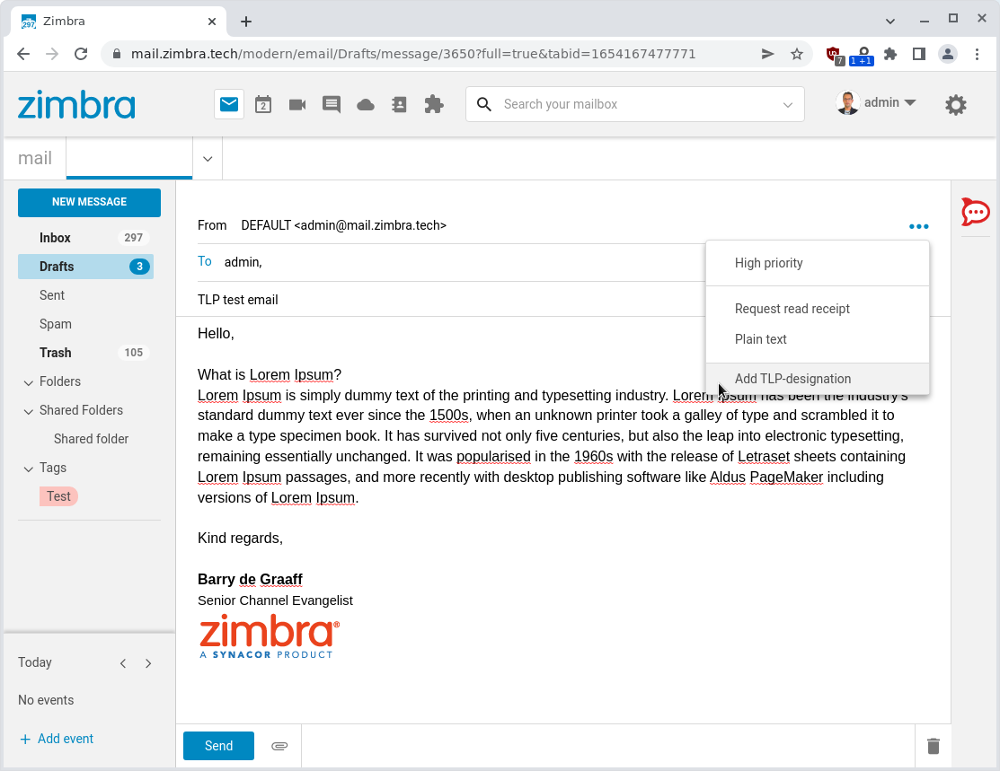
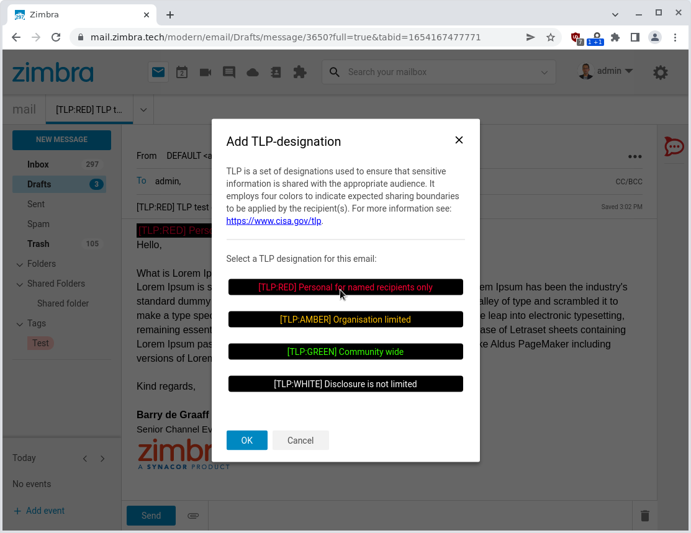
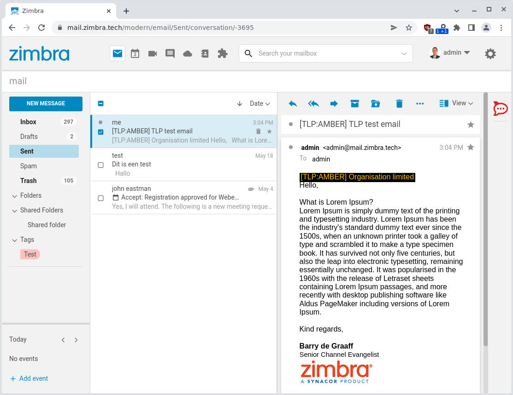

# Traffic Light Protocol (TLP) Zimlet

The Traffic Light Protocol (TLP) Zimlet adds a menu to Zimbra Modern UI that allows the use of First.org Traffic Light Protocol (TLP) confidentiality designations.

By using TLP you can set a confidentiality designation on an email similar to the functionality offered by the [Confidential Header Zimlet](https://github.com/Zimbra/confidential-header-zimlet). Benefits of the TLP approach is that it works on any email client as TLP tags are added to the body and subject of an email and it does not use email headers.

For more information on TLP protocol see:

- [https://www.cisa.gov/tlp](https://www.cisa.gov/tlp)
- [https://www.first.org/tlp](https://www.first.org/tlp)

There is also a Thunderbird add-on that does the same: [https://addons.thunderbird.net/en-US/thunderbird/addon/tulpe/?src=search](https://addons.thunderbird.net/en-US/thunderbird/addon/tulpe/?src=search)

## Screenshots

> 
> 
> 
